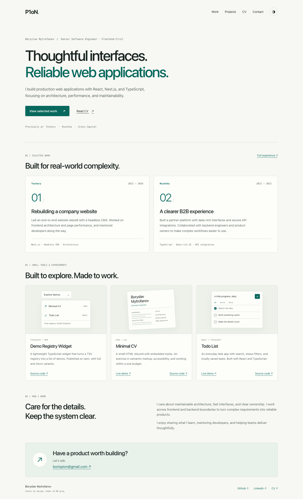
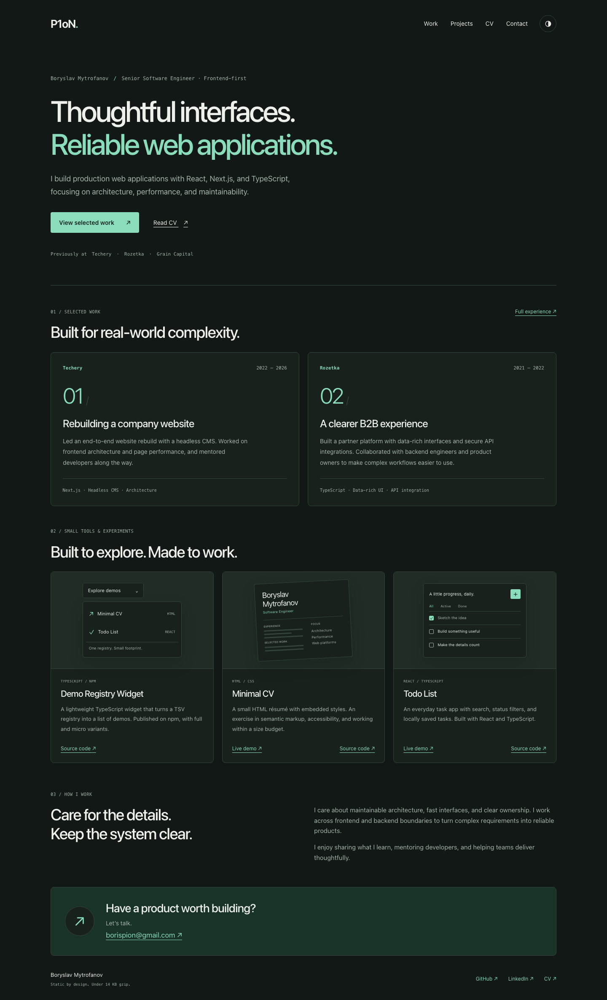
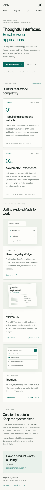
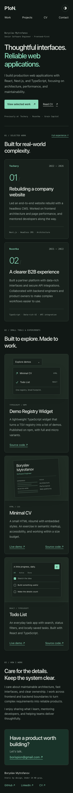

# Boryslav Mytrofanov — personal portfolio

A self-contained Astro portfolio for [p1on.github.io](https://p1on.github.io/). Static HTML, inline CSS and SVG, and a small theme switcher. No runtime framework, remote fonts, analytics, images, or data requests.

## Development

Requires Node.js 24 and npm.

```sh
npm ci
npm run dev
```

Edit the sections in `src/components`, content in `src/data/content.ts`, and theme/layout rules in `src/styles/global.css`. The page is assembled in `src/pages/index.astro`. Project illustrations are decorative HTML/CSS, not screenshots of commercial applications.

## Verification

```sh
npm run check
npm run build
npx playwright install chromium
npm test
```

The production build fails if `dist/index.html` exceeds **14,000 bytes with gzip level 6**, or references external rendering resources. It reports raw, gzip and Brotli sizes. This budget covers the complete HTML document, including styles, scripts and favicon. It excludes HTTP/TLS overhead and does not promise delivery in one network packet. The server controls actual HTTP compression.

Browser tests cover both themes at 360/768/1440 px, a single document request with no additional page resources, theme persistence, blocked storage, disabled JavaScript, keyboard navigation, anchors, and doubled text size.

For a mobile Lighthouse report, keep the production preview running and execute:

```sh
npm run preview
# In another terminal:
node scripts/lighthouse.mjs
```

Reports are saved in `test-results/`. Run Lighthouse without concurrent browser tests for a meaningful diagnostic measurement.

## Publishing

Pull requests run checks, the size gate, and browser tests. Their screenshots are available in the `browser-previews` Actions artifact. Pushes to `main` additionally publish `dist` to GitHub Pages.

At first release, change **Settings → Pages → Build and deployment → Source** from “Deploy from a branch” to **GitHub Actions**. Equivalent authenticated CLI command:

```sh
gh api --method PUT repos/P1oN/P1oN.github.io/pages -f build_type=workflow
```

Merge the reviewed PR to trigger publication. Check the Actions deployment, HTTPS response, content, actual `Content-Encoding`, and cold-cache network requests after release. CV and Todo List remain independently deployed at `/cv/` and `/todolist/`.

## Design previews

These review images are outside `public/` and never shipped to visitors.

| Light                                             | Dark                                            |
| ------------------------------------------------- | ----------------------------------------------- |
|  |  |
|    |    |
